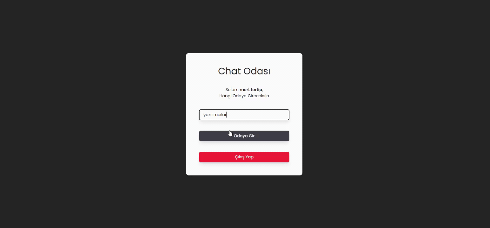

# 💬 Chat App

This project, offering a real-time messaging experience, is a modern chat application that allows users to communicate instantly.

---

## 🚀 Features

- 💬 Real-time messaging
- 👤 User-based chat
- 🔄 Instant data updates
- 📱 Responsive design
- ⚡ Fast and fluid user experience

---

## 🛠️ Tech Stack

- React.js
- JavaScript (ES6+)
- Socket.io / WebSocket
- ​​Node.js / Backend

- CSS / Tailwind

---

## 🧠 Project Overview

This project was developed to learn the logic of **real-time data communication**, which is frequently used in modern web applications.

---

## 📌 Key Learnings

Through this project, I gained experience in:

- Component-based React architecture

- Real-time data management

- API/Socket integration

- State management

- User interaction

---

# 💬 Chat App

Gerçek zamanlı mesajlaşma deneyimi sunan bu proje, kullanıcıların anlık olarak iletişim kurmasını sağlayan modern bir chat uygulamasıdır.

---

## 🚀 Features

- 💬 Gerçek zamanlı mesajlaşma
- 👤 Kullanıcı bazlı sohbet
- 🔄 Anlık veri güncelleme
- 📱 Responsive tasarım
- ⚡ Hızlı ve akıcı kullanıcı deneyimi

---

## 🛠️ Tech Stack

- React.js
- JavaScript (ES6+)
- Socket.io / WebSocket
- Node.js / Backend
- CSS / Tailwind

---

## 🧠 Project Overview

Bu proje, modern web uygulamalarında sıkça kullanılan **gerçek zamanlı veri iletişimi (real-time communication)** mantığını öğrenmek amacıyla geliştirilmiştir.

---

## 📌 Key Learnings

Bu proje sayesinde:

- Component tabanlı React mimarisi
- Gerçek zamanlı veri yönetimi
- API / Socket entegrasyonu
- State yönetimi
- Kullanıcı etkileşimi

konularında deneyim kazandım.

---

